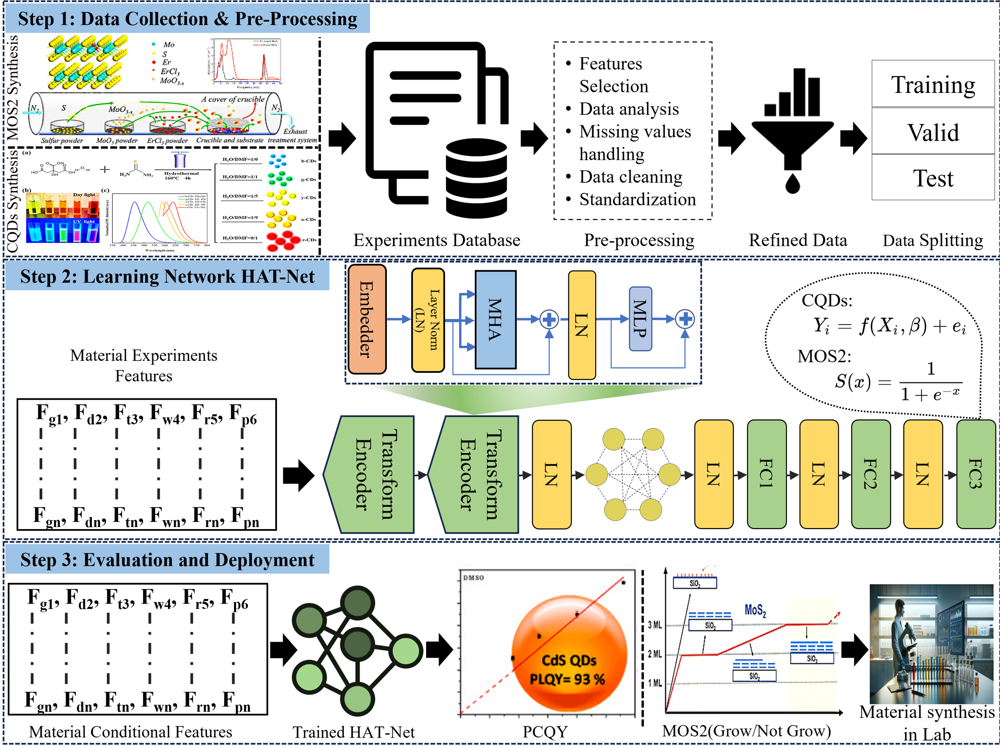

# HATNet: Hierarchical Attention Transformer Network

[](https://www.sciencedirect.com/science/article/pii/S1474034625003556)
[](https://www.sciencedirect.com/journal/advanced-engineering-informatics)
[](https://www.python.org/)
[](https://pytorch.org/)
[](#license)

Official implementation of **"HATNet: Hierarchical Attention Transformer Network for Material Synthesis Optimization"**, published in *Advanced Engineering Informatics* (Elsevier).

📄 **Paper**: [https://www.sciencedirect.com/science/article/pii/S1474034625003556](https://www.sciencedirect.com/science/article/pii/S1474034625003556)

---

## Overview

HATNet is a deep learning framework specifically developed to optimize the synthesis of organic and inorganic materials, including **molybdenum disulfide (MoS₂)**, and to estimate the **photoluminescent quantum yield (PLQY)**. By leveraging the power of the **multi-head attention (MHA) mechanism**, HATNet captures complex dependencies within feature spaces, offering a significant advancement over traditional models like XGBoost and Support Vector Machines (SVMs). This unified framework, designed for classification and regression tasks, achieved state-of-the-art performance in material synthesis optimization for MoS₂ and PLQY.

<p align="center">
  
</p>

---

## Key Features

| Feature | Description |
|---------|-------------|
| 🔄 **Unified Framework** | Combines classification and regression tasks using a shared attention-based architecture |
| 🎯 **State-of-the-Art Performance** | Achieves 95% classification accuracy for MoS₂ synthesis and lower MSE values for PLQY estimation |
| 🧠 **Automated Feature Learning** | Eliminates manual feature engineering by capturing intricate feature interactions |
| ⚡ **Multi-Head Attention** | Leverages transformer-based attention mechanisms for complex dependency modeling |

---

## Installation

### Prerequisites

- Python 3.8+
- PyTorch 2.0+
- CUDA (optional, for GPU acceleration)

### Setup

```bash
# Clone the repository
git clone https://github.com/munsif200/HATNet.git
cd HATNet

# Install dependencies
pip install torch numpy pandas scikit-learn matplotlib seaborn scipy
```

---

## Usage

### MoS₂ Synthesis Classification

```bash
python Mos2_classification.py
```

### PLQY Regression (Carbon Quantum Dots)

```bash
python CQDs_regression.py
```

---

## Citation

If you find this work useful for your research, please cite our paper:

```bibtex
@article{hatnet2025,
  title={HATNet: Hierarchical Attention Transformer Network for Material Synthesis Optimization},
  journal={Advanced Engineering Informatics},
  year={2025},
  publisher={Elsevier},
  url={https://www.sciencedirect.com/science/article/pii/S1474034625003556}
}
```

---

## Applications

HATNet addresses critical challenges in materials science, with applications in:

- 🔬 **Advanced Material Synthesis**: Optimization for electronics, optical, and other devices
- 📊 **Quantum Yield Prediction**: Estimation of photoluminescent properties
- 🧪 **Process Optimization**: Data-driven synthesis parameter tuning

---

## Acknowledgments

This research was supported by the **Nano & Material Technology Development Program** through the National Research Foundation of Korea (NRF) funded by the Ministry of Science and ICT.


---

## License

This project is released under the MIT License, ensuring accessibility to the research and development community.

---

## Contact

For questions or collaborations, please email to munsif@sju.ac.kr.
